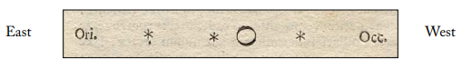
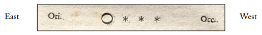
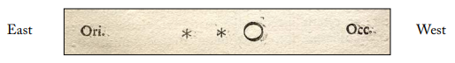
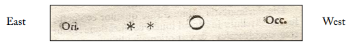
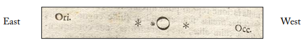
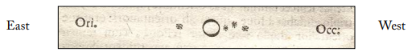
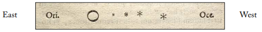
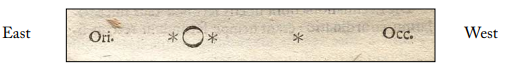

# Jupiter's Moons and the N-Body Problem

## Summary
Jupiter is the fifth planet from the Sun and by far the largest. Jupiter is more than twice as massive as all the other planets combined (the mass of Jupiter is 318 times that of Earth). Jupiter has around 70-80 known moons, many of which haven't been named yet. Due to it's size, Jupiter has lots of gravity, thus its moons have huge gravitational interactions through their rotation and translation movements.

This project pretends to simulate the trajectory of Jupiter's four biggests moons, also known as _the Galilean moons_, as well as their interactions, so we can make observations and reach some conclutions. The model we will draw on was created using the _N-Body problem_. In the next sections you will find a concise explanation of what the N-Body problem is, and how it helped us to solve our problem.

## Objectives
1) Understand the _N-Body problem_.
2) Analyze the behavior of the orbits of Jupiter's moons through plotting the simulation of a model based on the N-Body problem.
3) Compare our results and observations to Galileo's contribution back in 1610.

## Introduction
Probably the most significent contribution that Galileo Galilei made to science was the discovery of the four satellites around Jupiter that are now named in his honor. Galileo first observed the moons of Jupiter on January 7, 1610 through a homemade telescope. He originally thought he saw three stars near Jupiter, strung out in a line through the planet. The next evening, these stars seemed to have moved the wrong way, which caught his attention. Galileo continued to observe the stars and Jupiter for the next week. On January 11, a fourth star (which would later turn out to be Ganymede) appeared. After a week, Galileo had observed that the four stars never left the vicinity of Jupiter and appeared to be carried along with the planet, and that they changed their position with respect to each other and Jupiter. Finally, Galileo determined that what he was observing were not stars, but planetary bodies that were in orbit around Jupiter. This discovery provided evidence in support of the Copernican system and showed that everything did not revolve around the Earth. 
Galileo published his observations in Sidereus Nuncius in March 1610. The following pictures show his notes to the eight first days of observation: 

 (1) 
_January 7th 1610_ 
 (2) 
_January 8th 1610_ 
 (3) 
_January 10th 1610_ 
 (4) 
_January 11th 1610. "[...]This was at length seen clear as day in many subsequent 
observations, and also that there are not only three, but four wandering stars making  
their revolutions about Jupiter." Galileo Galilei._ 
 (5) 
_January 12th 1610_ 
 (6) 
_January 13th 1610_ 
 (7) 
_January 15th 1610. "[...] for the first time four little stars were seen by me in 
this formation with respect to Jupiter. Three were on the west and one on the east." 
Galileo Galiley._ 
 (8) 
_January 16th 1610_ 

Those eight first days of observations are very significant to us since it will be the basement to build up our conclusions at the end of this work.

### But, how is this related to the N-Body Problem?

The basic ideas of N-Body problem were published in 1687 by Sir Isaac Newton in his Principia. The limitations to his work was given later by Henry Poincaré, who described the non-integrability principle as applicable to problems of three and more bodies.

Classically, it refers to the problem of predicting the motion of N celestial bodies that interact gravitationally. Nowadays, other problems, such as those from molecular dynamics, are also often referred to as N-Body problems. For N=1 and N=2 the equations can be solved analytically. N=2 was completely solved by Johann Bernoulli. The case N=3 provides one of the richest of all unsolved dynamical problems because solutions only exists in special cases. In general, numerical methods must be used to simulate such systems.

Many physical phenomena directly or indirectly (when solving a discrete version of a continuous problem) involve, or can be simulated with particle systems, where each particle interacts with all other particles according to the laws of physics. Examples include the gravitational interaction among the stars in a galaxy or the Coulomb forces exerted by the atoms in a molecule and _the interaction between planets that orbit in a solar system_, which can be similarly applied to a planet and how its moons orbit around it. The challenge of efficiently carrying out the related calculations is generally known as the N-body problem.

Mathematically, the N-body problem can be formulated as: 
 (1) 

Where U(**X0**) is a physical quantity at x0 which can be obtained by summing the pairwise
interactions F(**x0**,**xi**) over the particles of the system. For instance, assume a system of
N particles, located at xi and having a mass of _mi_. The gravitational force exerted on a
particle **x** having a mass _m_ is then expressed as: 

  (2) 
where G is the gravitational constant.

Therefore, we will take advantage of this N-Body Problem model to predict Jupiter's moons positions through the time, so we can make a simulation of their orbits around this planet by setting up some initial conditions and plotting our results.

## Methodology
For the reproducibility of our results, please consider the following:  
**To make calculations a little bit easier and to reduce computation costs, moons were taken as if they orbit in the same plane and were initialized aligned in the same position.**
### Initial conditions
1) **Jupyter**   
&nbsp;&nbsp;&nbsp; position = [0, 0, 0] m  
&nbsp;&nbsp;&nbsp; velocity = [0, 0, 0] m/s  
&nbsp;&nbsp;&nbsp; mass = 1.898e27 kg  
2) **Io**  
&nbsp;&nbsp;&nbsp; position = [0, 422000000, 0] m  
&nbsp;&nbsp;&nbsp; velocity = [17334, 0, 0] m/s  
&nbsp;&nbsp;&nbsp; mass = 8.94e22 kg  
3) **Europa**  
&nbsp;&nbsp;&nbsp; position = [0, 671000000, 0] m  
&nbsp;&nbsp;&nbsp; velocity = [13740, 0, 0] m/s  
&nbsp;&nbsp;&nbsp; mass = 4.80e22 kg  
4) **Ganymede**  
&nbsp;&nbsp;&nbsp; position = [0, 1070000000, 0] m  
&nbsp;&nbsp;&nbsp; velocity = [10880, 0, 0] m/s   
&nbsp;&nbsp;&nbsp; mass = 1.48e23 kg  

5) **Callisto**  
position = [0, 1883000000, 0] m  
velocity = [8204, 0, 0] m/s  
mass = 1.08e23 kg  

6) **dt**  
dt = 1 s  

7) **Time**  
lenTime = 3600 * 24 * 8 s  

## Results

## Conclusions

## Bibliography

Title: N-body problem
Authors: Bhatnagar, K. B. & Saha, L. M.
Journal: Astronomical Society of India, Bulletin (ISSN 0304-9523), vol. 21, no. 1, p. 1-25
Bibliographic Code: 1993BASI...21....1B
Link: http://articles.adsabs.harvard.edu//full/1993BASI...21....1B/0000001.000.html

http://www.astrosen.unam.mx/~aguilar/MySite/Outreach_files/Nbody1_eng.pdf 
https://www.ceremade.dauphine.fr/~fejoz/Articles/Fejoz_2014_nbp.pdf 
http://cosweb1.fau.edu/~jmirelesjames/introductionNotes.pdf 
https://gereshes.com/2018/05/07/what-is-the-n-body-problem/ 
https://arxiv.org/abs/astro-ph/0503600 
https://www.cs.usask.ca/~spiteri/CMPT851/notes/nBody.pdf 
http://www.cs.hut.fi/~ctl/NBody.pdf 
https://nineplanets.org/jupiter/  
http://solarviews.com/eng/galdisc.htm  
http://people.reed.edu/~wieting/mathematics537/SideriusNuncius.pdf  
